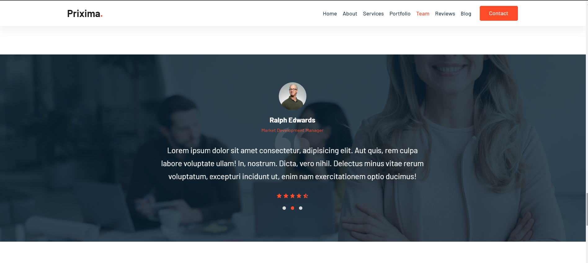

# Microsoft-future-ready-talent-internship :star2:

### This is a web based application developed for a business named PRIXIMA.

###  This web based bsiness application has been developed for the accomplishment of Future Ready Talent Internship program launched by Microsoft, Future Skills Prime, Quess, Github and EY.

### Project Link - https://vishalmanikpuri.github.io/microsoft-future-ready-talent1/

### Demo Video - https://youtu.be/nhHbRbNQiGA

## Features and Functionalities

- Interactive and responsive UI.
- Has many graphical and visual innovative effects.
- Have an aesthetically pleasing visual design and architecture.
- Has collection of many web pages including Home, About Us, Contact, Blog, Team Member pages etc.

### Web Technologies used: HTML, CSS, JS, Bootstrap

### IDE: VS-Code

### SCREENSHOTS :camera_flash:

#### Home Page

#### About

#### Projects

#### Team

#### Testimonial

#### Blog

#### Footer

### Industry :
Ed-tech

### Project Title :
Business Website

### Problem Statement/Opportunity :
A Business company wants to build a sample Front End prototype website for their business as the online shopping industry has been growing at an incredible rate, and so have marketing challenges. This website can help you generate business, increase brand recall value, promote goodwill in front of customers and target audience, as well as deliver strong marketing messages. 

### Project Description :
Core Idea of Project is to build an sample prototype Business Website  for a business company with the help of HTML, CSS, JAVASCRIPT, BOOTSTRAP. A business’s online presence, regardless of industry, can have a massive impact on its success. In this day and age, some businesses still don’t realize that a majority of their customers will visit their website before making a purchase.

### Primary Azure Technology :
Azure DevOps, Azure Artifacts, Azure Pipelines

### Other Azure Technologies : Azure Videos, Web app for containers
